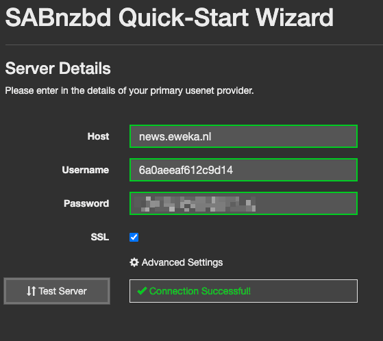
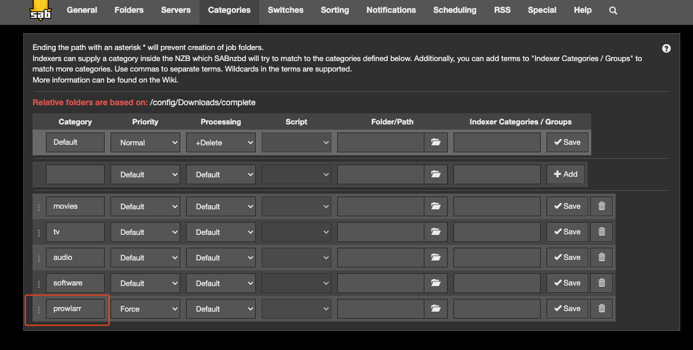
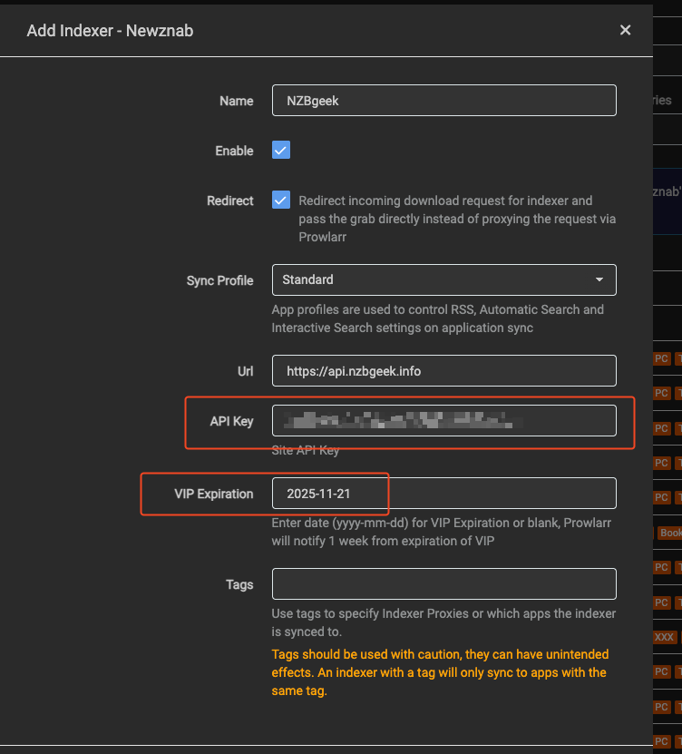
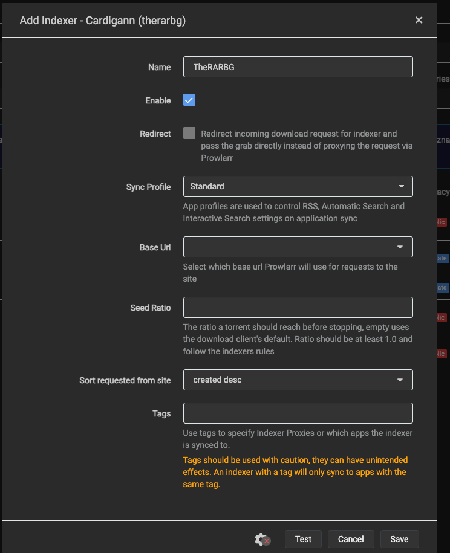
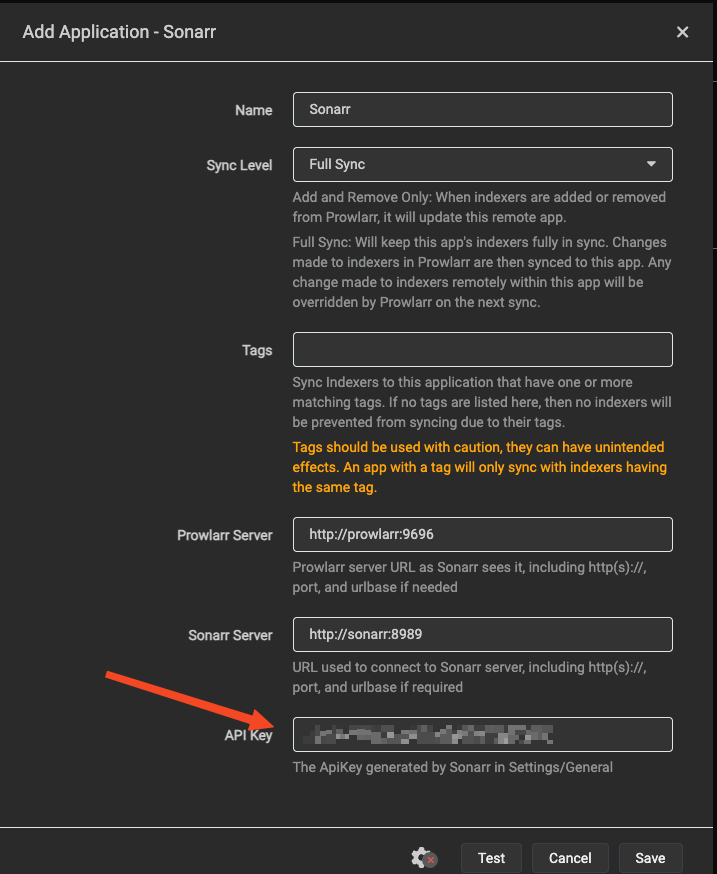
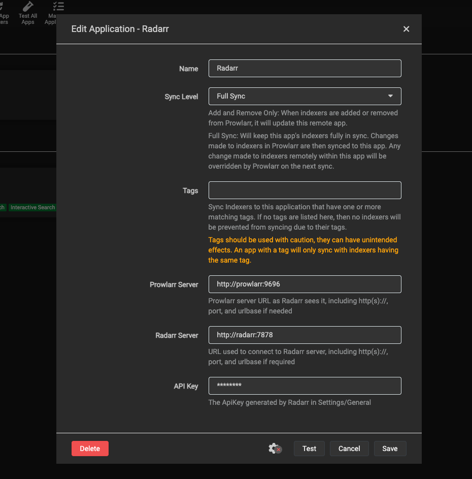
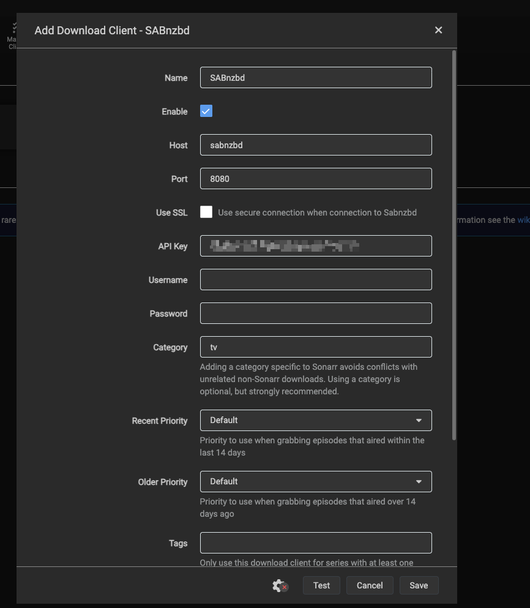
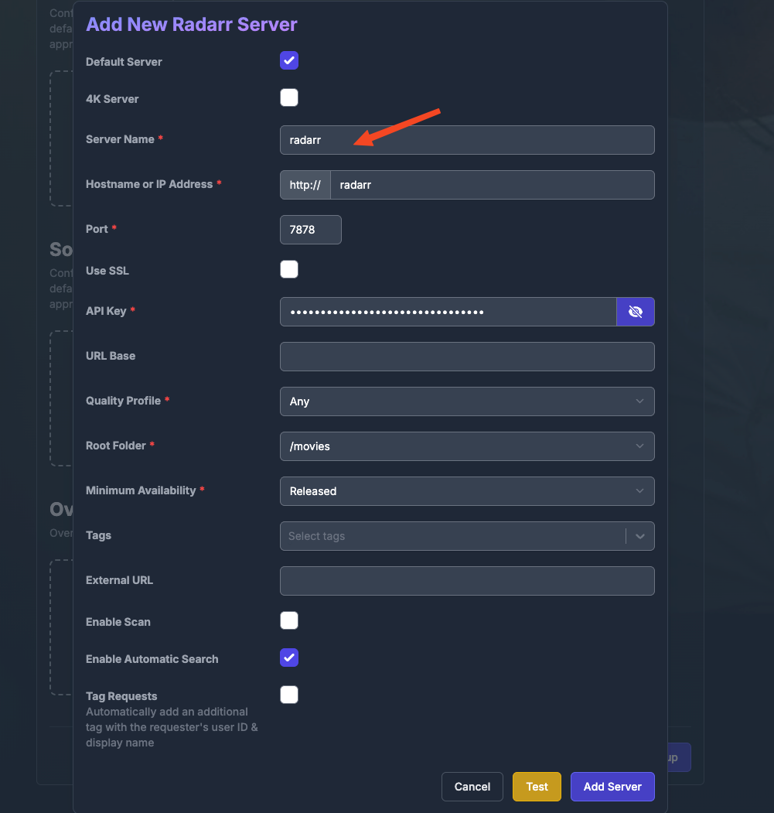
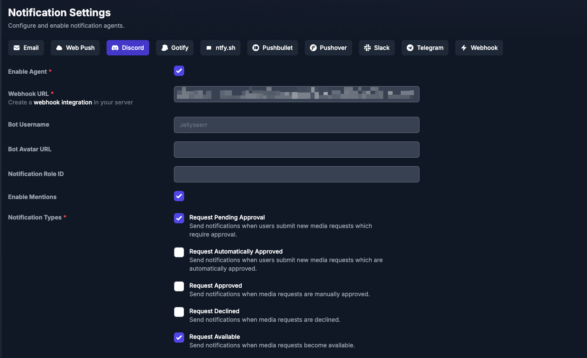
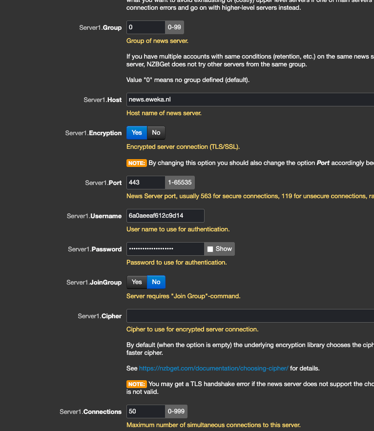

# Steps currently done via the UI

## SabNZBD

- Add `Euweka` as the server (see `1Password` for details)

- Add the categorry for `prowlarr` (if used)

- Note down the API key for SABNzbd (store this in `1password`)

## Prowlarr

### Indexers
I use indexers:

- [nzbgeek](https://nzbgeek.info/dashboard.php?myaccount)

- RARBG might also work for torrents

### Apps

- Add your Sonarr

- Add your Radarr

## Sonarr

- Add download client SABNzbd

> set language!

## Jellyseer

- Add `Jellyfin`, `Radarr` and `Sonarr`. Use the Docker container's name

- Dont forget to add notification

## NZBGet

